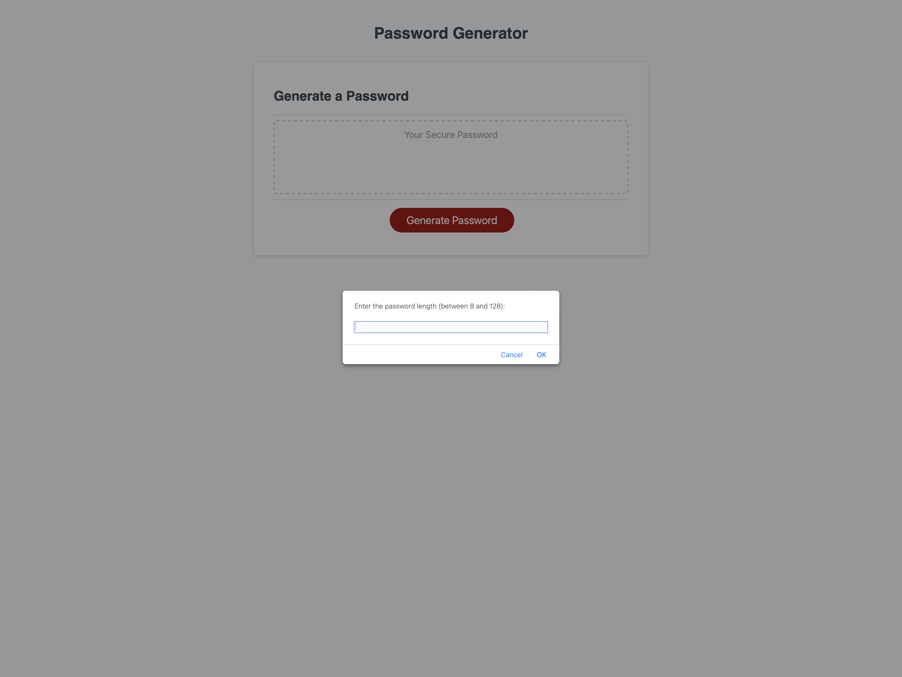

# Password Generator

## Description

This application enables employees to generate random passwords based on criteria that they’ve selected. This application will run in the browser and will feature dynamically updated HTML and CSS powered by JavaScript code that you write. It will have a clean and polished, responsive user interface that adapts to multiple screen sizes.

## Installation

N/A

## Usage

To generate a password follow the prompts on the screen.

Here is a screenshot fo the website in action:

Here is a link of the website:

[https://lvanness7690.github.io/password-generator/]

## Credits

Used starter code from © 2023 edX Boot Camps LLC. Confidential and Proprietary. All Rights Reserved.

## License

Please refer to the license in the repo.